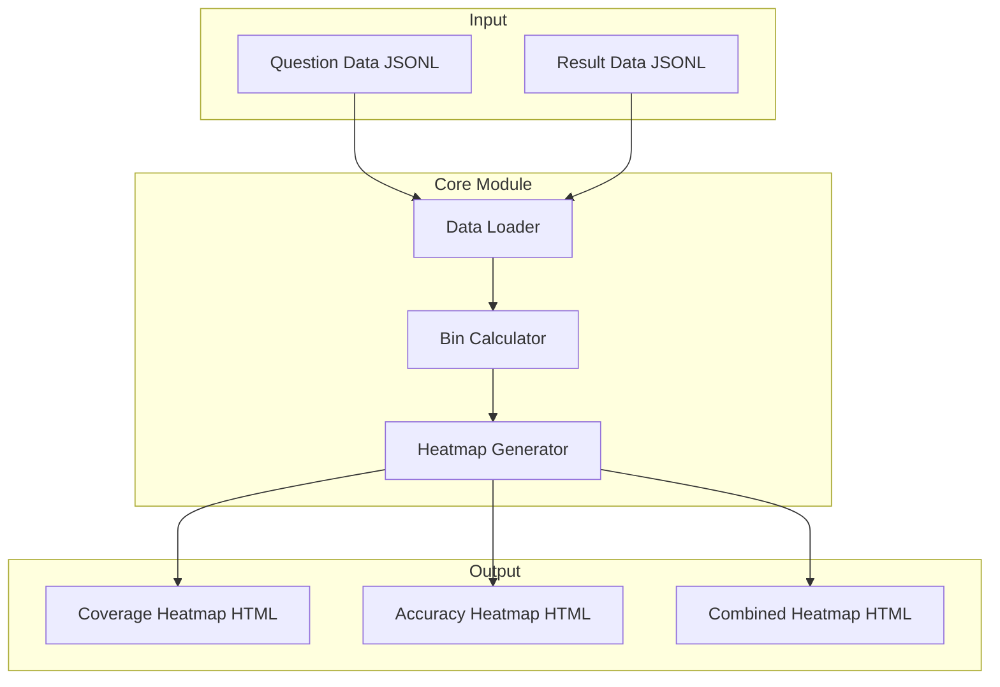

# Design Document: Heatmap Generator

## Overview

热力图生成器是 Hogwarts Bench 测试框架的可视化扩展模块，用于生成上下文覆盖度和模型正确度的热力图。该模块将集成到现有的 `src/reporter/` 目录中，复用现有的 Plotly 可视化基础设施。

核心设计理念：
- 将上下文按 token 位置划分为可配置数量的 bins
- 计算每个 bin 的覆盖度（问题分布密度）和正确度（平均得分）
- 使用 Plotly 生成交互式热力图

## Architecture



## Components and Interfaces

### 1. Data Loader (`load_question_data`, `load_result_data`)

负责从 JSONL 文件加载和验证数据。

```python
from typing import List, Tuple, Optional
from dataclasses import dataclass

@dataclass
class QuestionPosition:
    """问题位置信息"""
    start_pos: int
    end_pos: int

@dataclass
class QuestionEntry:
    """问题条目"""
    position: QuestionPosition

@dataclass
class ResultEntry:
    """测试结果条目"""
    position: QuestionPosition
    score: float

def load_question_data(file_path: str) -> Tuple[List[QuestionEntry], int]:
    """
    加载问题数据文件
    
    Args:
        file_path: JSONL 文件路径
        
    Returns:
        Tuple of (valid_entries, skipped_count)
    """
    pass

def load_result_data(file_path: str) -> Tuple[List[ResultEntry], int]:
    """
    加载测试结果数据文件
    
    Args:
        file_path: JSONL 文件路径
        
    Returns:
        Tuple of (valid_entries, skipped_count)
    """
    pass
```

### 2. Bin Calculator (`calculate_bins`)

负责将上下文划分为 bins 并计算每个 bin 的统计数据。

```python
from typing import List, Optional
from dataclasses import dataclass

@dataclass
class BinStats:
    """单个 bin 的统计数据"""
    start_pos: int
    end_pos: int
    coverage: float  # 归一化的覆盖度 (0-1)
    accuracy: Optional[float]  # 平均正确率，None 表示无数据
    question_count: int  # 该 bin 中的问题数量

def calculate_coverage_bins(
    questions: List[QuestionEntry],
    context_length: int,
    num_bins: int = 50
) -> List[BinStats]:
    """
    计算覆盖度 bins
    
    Args:
        questions: 问题列表
        context_length: 上下文总长度
        num_bins: bin 数量
        
    Returns:
        List of BinStats with coverage values
    """
    pass

def calculate_accuracy_bins(
    results: List[ResultEntry],
    context_length: int,
    num_bins: int = 50
) -> List[BinStats]:
    """
    计算正确度 bins
    
    Args:
        results: 测试结果列表
        context_length: 上下文总长度
        num_bins: bin 数量
        
    Returns:
        List of BinStats with accuracy values
    """
    pass
```

### 3. Heatmap Generator (`create_heatmap`)

负责使用 Plotly 生成热力图 HTML。

```python
from typing import List
from enum import Enum

class HeatmapMode(Enum):
    COVERAGE = "coverage"
    ACCURACY = "accuracy"
    COMBINED = "combined"

def create_coverage_heatmap(
    bins: List[BinStats],
    context_length: int
) -> str:
    """
    创建覆盖度热力图
    
    Args:
        bins: bin 统计数据列表
        context_length: 上下文总长度
        
    Returns:
        Plotly HTML string
    """
    pass

def create_accuracy_heatmap(
    bins: List[BinStats],
    context_length: int
) -> str:
    """
    创建正确度热力图
    
    Args:
        bins: bin 统计数据列表
        context_length: 上下文总长度
        
    Returns:
        Plotly HTML string
    """
    pass

def create_combined_heatmap(
    coverage_bins: List[BinStats],
    accuracy_bins: List[BinStats],
    context_length: int
) -> str:
    """
    创建组合热力图
    
    Args:
        coverage_bins: 覆盖度 bin 统计数据
        accuracy_bins: 正确度 bin 统计数据
        context_length: 上下文总长度
        
    Returns:
        Plotly HTML string
    """
    pass
```

### 4. CLI Interface

```python
def main():
    """
    命令行入口
    
    Usage:
        python -m src.heatmap --mode coverage --questions data/questions.jsonl --output coverage.html
        python -m src.heatmap --mode accuracy --results data/results.jsonl --output accuracy.html
        python -m src.heatmap --mode combined --questions data/questions.jsonl --results data/results.jsonl --output combined.html
    """
    pass
```

## Data Models

### Input Data Format

**Question Data (JSONL)**:
```json
{
  "question": "问题文本",
  "position": {
    "start_pos": 25632,
    "end_pos": 55632
  }
}
```

**Result Data (JSONL)**:
```json
{
  "question": "问题文本",
  "position": {
    "start_pos": 25632,
    "end_pos": 55632
  },
  "score": 1.0
}
```

### Internal Data Structures

```python
@dataclass
class BinStats:
    start_pos: int      # bin 起始位置
    end_pos: int        # bin 结束位置
    coverage: float     # 归一化覆盖度 [0, 1]
    accuracy: Optional[float]  # 平均正确率 [0, 1] 或 None
    question_count: int # 问题数量
```

### Coverage Calculation Algorithm

对于每个问题，计算其在各 bin 中的覆盖比例：

```
coverage[bin] = Σ (overlap(question, bin) / bin_size) / total_questions
```

其中 `overlap(question, bin)` 是问题区间与 bin 区间的交集长度。

### Accuracy Calculation Algorithm

对于每个 bin，计算落入该 bin 的问题的平均得分：

```
accuracy[bin] = Σ score[q] / count[q]  for all q where q.start_pos in bin
```

如果 bin 中没有问题，accuracy 为 None。


## Correctness Properties

*A property is a characteristic or behavior that should hold true across all valid executions of a system—essentially, a formal statement about what the system should do. Properties serve as the bridge between human-readable specifications and machine-verifiable correctness guarantees.*

### Property 1: Data Parsing Round-Trip

*For any* valid JSONL entry containing position information, parsing the entry and extracting position fields SHALL return the exact same start_pos and end_pos values as in the original data.

**Validates: Requirements 1.1, 2.1**

### Property 2: Bin Count Matches Configuration

*For any* context length and num_bins parameter, the calculate_coverage_bins and calculate_accuracy_bins functions SHALL return exactly num_bins bins.

**Validates: Requirements 1.2**

### Property 3: Proportional Coverage Conservation

*For any* single question spanning multiple bins, the sum of its proportional coverage contributions across all bins SHALL equal 1.0 (within floating-point tolerance).

**Validates: Requirements 1.3**

### Property 4: Coverage Values Bounded

*For any* set of questions and any bin configuration, all coverage values in the resulting bins SHALL be in the range [0, 1].

**Validates: Requirements 1.4**

### Property 5: Accuracy Equals Average Score

*For any* bin containing one or more questions, the accuracy value SHALL equal the arithmetic mean of the scores of all questions whose start_pos falls within that bin.

**Validates: Requirements 2.2**

### Property 6: Empty Bins Have None Accuracy

*For any* bin containing zero questions, the accuracy value SHALL be None (not 0.0).

**Validates: Requirements 2.3**

### Property 7: Combined Heatmap Bin Consistency

*For any* combined heatmap generated from coverage and accuracy data, the bin boundaries (start_pos, end_pos) in the coverage bins SHALL be identical to those in the accuracy bins.

**Validates: Requirements 3.3**

### Property 8: Mode Parameter Validation

*For any* mode string, the CLI SHALL accept it if and only if it is one of "coverage", "accuracy", or "combined".

**Validates: Requirements 4.1**

### Property 9: Bins Parameter Configuration

*For any* positive integer bins parameter, the generated heatmap SHALL contain exactly that number of bins. When no bins parameter is provided, the default SHALL be 50.

**Validates: Requirements 4.5**

### Property 10: Data Validation Correctness

*For any* JSONL entry, validation SHALL pass if and only if the entry contains all required fields (position.start_pos, position.end_pos for questions; position, score for results).

**Validates: Requirements 5.1, 5.2**

### Property 11: Invalid Data Skipping

*For any* input containing a mix of valid and invalid entries, the loader SHALL return only the valid entries and correctly count the skipped entries.

**Validates: Requirements 5.3**

### Property 12: Entry Count Conservation

*For any* input data, the sum of valid entries count and skipped entries count SHALL equal the total number of entries in the input file.

**Validates: Requirements 5.4**

## Error Handling

### Input Validation Errors

| Error Condition | Handling |
|----------------|----------|
| Missing required file | Return error message with missing parameter name |
| File not found | Return error message with file path |
| Invalid JSONL format | Skip entry, log warning, continue processing |
| Missing position fields | Skip entry, log warning, continue processing |
| Invalid score value | Skip entry, log warning, continue processing |

### Runtime Errors

| Error Condition | Handling |
|----------------|----------|
| Empty input data | Generate empty heatmap with informative message |
| Zero context length | Return error message |
| Invalid num_bins (≤0) | Return error message |

## Testing Strategy

### Unit Tests

单元测试用于验证特定示例和边界情况：

1. **Data Loading Tests**
   - Test loading valid JSONL file
   - Test handling of missing files
   - Test handling of malformed JSON
   - Test metadata line skipping

2. **Bin Calculation Tests**
   - Test with single question
   - Test with question spanning entire context
   - Test with questions at boundaries
   - Test with empty input

3. **Heatmap Generation Tests**
   - Test HTML output contains Plotly elements
   - Test color scale application
   - Test hover text generation

4. **CLI Tests**
   - Test each mode with valid inputs
   - Test error messages for missing parameters

### Property-Based Tests

使用 Hypothesis 库进行属性测试，每个属性测试至少运行 100 次迭代。

**Testing Framework**: pytest + hypothesis

**Test Configuration**:
```python
from hypothesis import given, settings
from hypothesis import strategies as st

@settings(max_examples=100)
@given(...)
def test_property_name():
    # Property test implementation
    pass
```

**Property Test Tags**:
- 每个属性测试必须包含注释引用设计文档中的属性
- 格式: `# Feature: heatmap-generator, Property N: Property Title`
