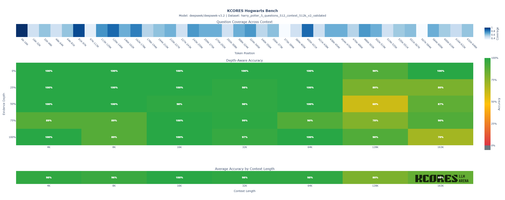

# Hogwarts-bench


使用小说评估大语言模型长上下文能力的自动化测试框架

## 概述

Hogwarts-bench 是一个"大海捞针"风格的基准测试工具, 系统性地评估大语言模型在长文档中不同上下文长度和位置处的事实检索、细节记忆和信息综合能力. 

该框架可以是用任意小说生成标准化语料库, 然后进行测试.



### 架构

该框架由三个独立的 CLI 工具组成, 可以顺序执行或单独执行：

1. **问题生成器** (`generate.py`)：从小说文本自动生成测试问题
2. **测试工具** (`test.py`)：在目标 LLM 上执行测试并收集结果
3. **报告生成器** (`report.py`)：分析结果并生成交互式 HTML 报告

### 使用方法

[中文](./USAGE_zh_CN.md)  
[English](./USAGE_en_US.md)  

### 快速开始

使用验证过的数据集并且上下文分布在4K-200K,进行测试:

```
python -m src.test \
    --novel data/harry_potter_5.txt \
    --data_set data/harry_potter_5_questions_512_context_512k_v2_validated.jsonl \
    --depth-mode uniform \
    --context-lengths 4000,8000,16000,32000,64000,128000,192000,25600 \
    --output report/results_depth.jsonl
```

生成 report:

```
python -m src.heatmap \
    --mode depth \
    --questions data/harry_potter_5_questions_512_context_512k_v2_validated.jsonl \
    --results report/results_depth.jsonl \
    --output report/combined.html
```

### License

MIT
