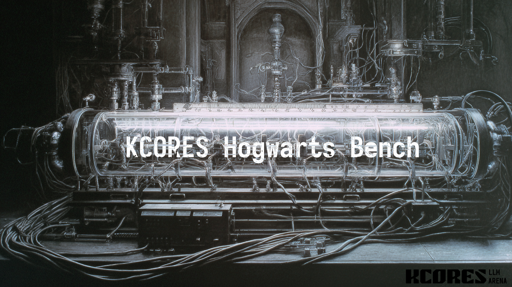

# Hogwarts-bench

使用《哈利·波特》小说系列评估大语言模型长上下文能力的自动化测试框架。

## 概述

Hogwarts-bench 是一个"大海捞针"风格的基准测试工具，系统性地评估大语言模型在长文档中不同上下文长度和位置处的事实检索、细节记忆和信息综合能力。

该框架使用《哈利·波特》小说系列作为标准化语料库进行测试：
- **事实检索**：模型能否在不同位置找到特定信息？
- **细节记忆**：模型能否记住文本中的细粒度细节？
- **信息综合**：模型能否整合来自多个部分的信息？
- **位置偏差**：在某些上下文位置，性能是否会下降？

### 主要特性

- **自动问题生成**：从任意小说文本生成多样化的测试问题
- **灵活的采样策略**：分层或随机采样以覆盖不同文本区域
- **并发处理**：并行 API 调用以加快生成和测试速度
- **健壮的错误处理**：针对 API 失败的重试逻辑和回退策略
- **交互式报告**：带有可视化和错误分析的 HTML 报告
- **可定制提示词**：易于修改的 JSON 模板，适用于不同用例

### 架构

该框架由三个独立的 CLI 工具组成，可以顺序执行或单独执行：

1. **问题生成器** (`generate.py`)：从小说文本自动生成测试问题
2. **测试工具** (`test.py`)：在目标 LLM 上执行测试并收集结果
3. **报告生成器** (`report.py`)：分析结果并生成交互式 HTML 报告

### 使用方法

[中文](./USAGE_zh_CN.md)  
[English](./USAGE_en_US.md)  
